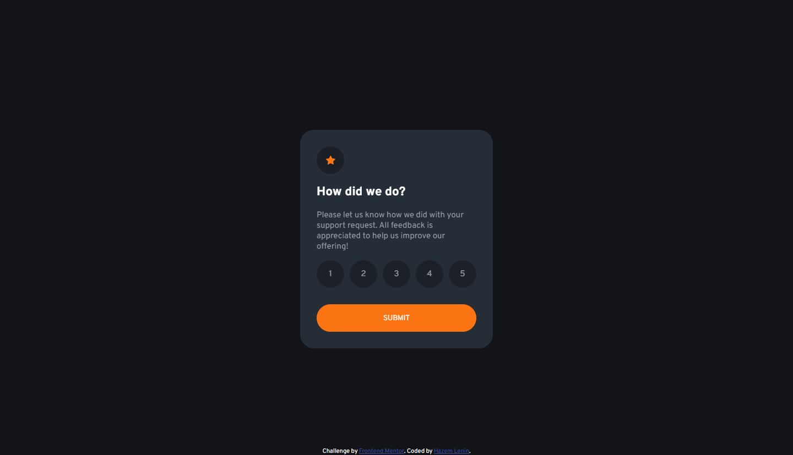

# Frontend Mentor - Interactive rating component solution

This is a solution to the [Interactive rating component challenge on Frontend Mentor](https://www.frontendmentor.io/challenges/interactive-rating-component-koxpeBUmI). Frontend Mentor challenges help you improve your coding skills by building realistic projects. 

## Table of contents

- [Overview](#overview)
  - [The challenge](#the-challenge)
  - [Screenshot](#screenshot)
  - [Links](#links)
- [My process](#my-process)
  - [Built with](#built-with)
  - [What I learned](#what-i-learned)
  - [Continued development](#continued-development)
  - [Useful resources](#useful-resources)
- [Author](#author)

## Overview

### The challenge

Users should be able to:

- View the optimal layout for the app depending on their device's screen size
- See hover states for all interactive elements on the page
- Select and submit a number rating
- See the "Thank you" card state after submitting a rating

### Screenshot



### Links

- Solution URL: [Github](https://www.frontendmentor.io/solutions/interactive-rating-component-solution-_pUQfWvTwq)
- Live Site URL: [Github Pages](https://hazemlenin.github.io/interactive-rating-component-challenge-on-frontend-mentor/)

## My process

### Built with

- Semantic HTML5 markup
- Flexbox
- SASS (CSS preprocessor)
- Javascript

### What I learned

I learned new ways to make great transition between states like filpping card animation.
Inspired from this [CodePen](https://codepen.io/SiraajHassni/pen/oNodqrO) by Siraaj Hassani.
```scss
// There is more code but not included because it's not related to the animation.

.wrapper {
    background: transparent;
    perspective: 1000px;

    &.flipped .box {
        transform: rotateY(180deg);
    }
}

.thank-you {
        transform: rotateY(180deg);
        margin-top: -117%;
    }

.rating, .thank-you {
        padding: 30px;
        background: $dark-blue;
        border-radius: 25px;
        -webkit-backface-visibility: hidden;
        backface-visibility: hidden;
    }


```

It was my first time to make error animation!
```scss
@keyframes refuse {
    /*
        1. center
        2. right
        3. left
        4. right
        5. center
    */
    0%, 100% { // center
        transform: translateX(0);
    }
    25%, 75%{ // right
        transform: translateX(20px);
    }
    50% { //left
        transform: translateX(-20px);
    }
}
```

### Continued development

- Working with absoluted DIVs.
- Adjust colors to be more.

### Useful resources

- [Siraaj Hassni's CodePen](https://codepen.io/SiraajHassni/pen/oNodqrO) - This helped me to mkae card flipping animation. I really liked this animation and will use it going forward.

## Author

- Website - [Hazem Lenin](https://HazemLenin.github.io)
- Frontend Mentor - [@HazemLenin](https://www.frontendmentor.io/profile/HazemLenin)